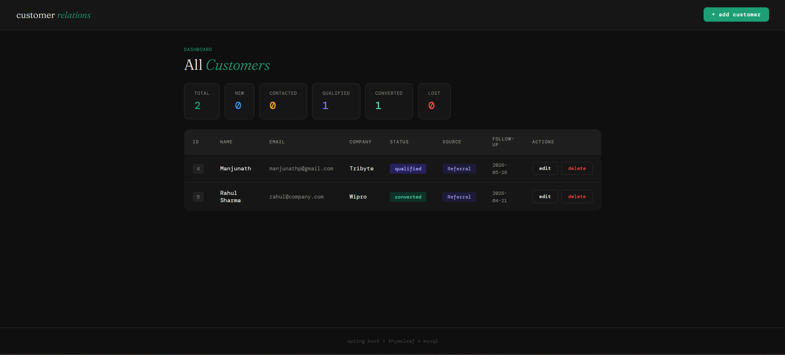
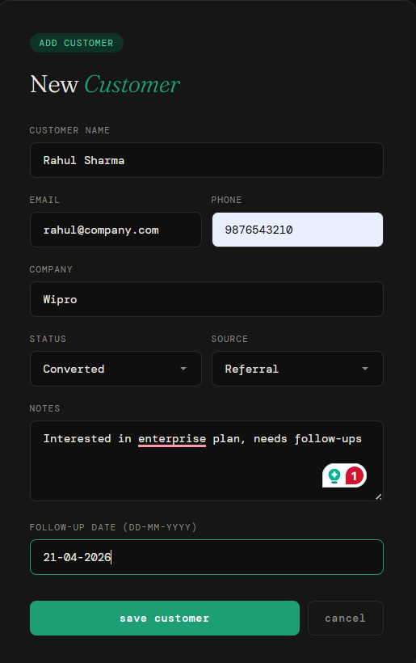
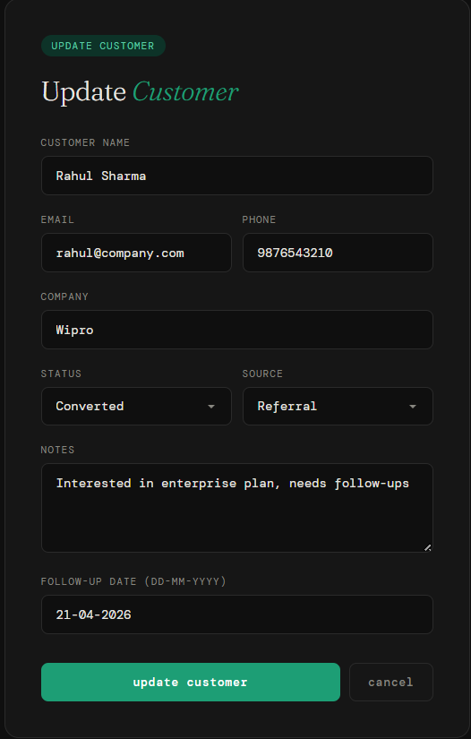

# Customer Management System

A full-stack CRUD web application for managing customer records, built with Spring Boot, Spring MVC, Spring Data JPA, and Thymeleaf.

## Tech Stack

- **Backend:** Spring Boot, Spring MVC, Spring Data JPA
- **Frontend:** Thymeleaf, HTML5, CSS3, Bootstrap
- **Database:** MySQL
- **Build Tool:** Maven

## Features

- View all customers in a paginated list
- Add a new customer
- Update existing customer details
- Delete a customer
- Form validation with error messages
- Responsive UI with Bootstrap

## Screenshots

### Customer List


### Add Customer


### Update Customer


## Prerequisites

- Java 17 or higher
- Maven 3.6+
- MySQL 8.0+

## Getting Started

1. **Clone the repository**

```bash
git clone https://github.com/YOUR_USERNAME/customer-management-spring-mvc.git
cd customer-management-spring-mvc
```

2. **Create a MySQL database**

```sql
CREATE DATABASE customer_db;
```

3. **Configure the database connection**

Open `src/main/resources/application.properties` and update the following:

```properties
spring.datasource.url=jdbc:mysql://localhost:3306/customer_db
spring.datasource.username=your_username
spring.datasource.password=your_password
```

4. **Run the application**

```bash
mvn spring-boot:run
```

5. **Open in browser**

Navigate to `http://localhost:8080` in your web browser.

## Project Structure

```
src/
├── main/
│   ├── java/
│   │   └── com/example/customermanagement/
│   │       ├── controller/      # Spring MVC controllers
│   │       ├── entity/          # JPA entity classes
│   │       ├── repository/      # Spring Data JPA repositories
│   │       ├── service/         # Business logic layer
│   │       └── Application.java
│   └── resources/
│       ├── templates/           # Thymeleaf HTML templates
│       ├── static/              # CSS, JS, images
│       └── application.properties
```

## API Endpoints

| Method | URL                  | Description              |
|--------|----------------------|--------------------------|
| GET    | `/customers`         | List all customers       |
| GET    | `/customers/add`     | Show add customer form   |
| POST   | `/customers/save`    | Save a new customer      |
| GET    | `/customers/update`  | Show update customer form|
| GET    | `/customers/delete`  | Delete a customer        |

## Adding Screenshots

1. Create a `screenshots/` folder in the project root.
2. Take screenshots of your running application.
3. Save them as `customer-list.png`, `add-customer.png`, `update-customer.png`.
4. They will automatically appear in this README.

## License

This project is for learning and practice purposes.
